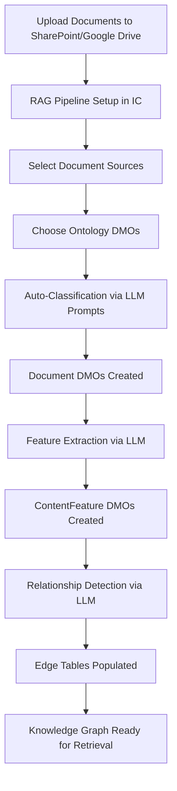

# Knowledge Graph Ontology for Deterministic RAG Enhancement

> **Solving RAG's accuracy and consistency challenges through expert-validated, relationship-grounded retrieval for Agentforce**

---

## Overview

This repository contains a comprehensive Knowledge Graph (KG) Ontology design for deterministic Retrieval-Augmented Generation (RAG) systems, grounded in **Salesforce Data Cloud Data Model Objects (DMOs)**.

### The Problem

Traditional RAG systems suffer from:
- **Inconsistent answers** - Same query returns different results
- **Unreliable sources** - Marketing claims treated same as engineering specs
- **Outdated information** - No version control or temporal awareness
- **Unvalidated claims** - No link between claims and supporting evidence
- **Lack of traceability** - Users don't know why a specific answer was given

### The Solution

A semantic Knowledge Graph Ontology that:
1. **Reuses** 89+ standard Salesforce Data Cloud DMOs as foundation
2. **Embellishes** DMOs with RAG-specific metadata (authority, versioning, validation)
3. **Auto-generates** KG via LLM-powered classification and extraction
4. **Ensures deterministic retrieval** through structured relationships and authority rules

### Key Benefits

| Benefit | How We Achieve It |
|---------|-------------------|
| **Deterministic Answers** | Same query → same result every time via authority-weighted graph traversal |
| **Authoritative Sources** | Engineering specs > Marketing claims through department authority levels |
| **Temporal Currency** | Version chains ensure only current, non-deprecated docs are retrieved |
| **Validated Claims** | Marketing claims linked to test reports/certifications via ValidationEvidence |
| **Full Traceability** | Every answer cites source document with validation chain |
| **No Manual Configuration** | Auto-generated via LLM prompts during RAG pipeline setup |

---

## Architecture

### Ontology Structure

```
┌─────────────────────────────────────────────────────────────────┐
│                    SALESFORCE DATA CLOUD DMOs                   │
│  (89+ Standard Objects - Individual, Party, Product, etc.)      │
└─────────────────┬───────────────────────────────────────────────┘
                  │
                  │ Inheritance & Embellishment
                  ▼
┌─────────────────────────────────────────────────────────────────┐
│                 RAG KNOWLEDGE GRAPH ONTOLOGY                    │
├─────────────────────────────────────────────────────────────────┤
│  REUSED DMOs (Embellished):                                     │
│   • Individual → Authors, Approvers, SMEs                       │
│   • Party → Departments (authority attribution)                 │
│   • Product → Product context & world knowledge                 │
│   • Brand, ProductCategory → Product hierarchy                  │
├─────────────────────────────────────────────────────────────────┤
│  CUSTOM DMOs (Built on DMO Patterns):                           │
│   • Document (Party pattern) → Enterprise documents             │
│   • ContentFeature → Extracted specs & claims                   │
│   • ValidationEvidence (Case pattern) → Test reports, certs     │
│   • DocumentRelationship → Version chains, references           │
│   • DocumentVersion → Version control                           │
│   • RetrievalContext (Engagement pattern) → Analytics           │
└─────────────────┬───────────────────────────────────────────────┘
                  │
                  │ Edge Tables (Relationships)
                  ▼
┌─────────────────────────────────────────────────────────────────┐
│                    KNOWLEDGE GRAPH EDGES                         │
│  • AUTHORED_BY: Document → Individual                           │
│  • PUBLISHED_BY: Document → Department                          │
│  • DESCRIBES_PRODUCT: Document → Product                        │
│  • SUPERSEDES: Document → Document                              │
│  • CONTAINS_FEATURE: Document → ContentFeature                  │
│  • VALIDATED_BY: ContentFeature → ValidationEvidence            │
│  • CONTRADICTS: Document → Document (conflict detection)        │
└─────────────────────────────────────────────────────────────────┘
```

---

## Repository Contents

### Core Documentation

| File | Description |
|------|-------------|
| **[RAG_KG_ONTOLOGY_DESIGN.md](RAG_KG_ONTOLOGY_DESIGN.md)** | Complete ontology design with DMO mappings, relationships, graph walks |
| **[DMO_THINKING_GUIDE.md](DMO_THINKING_GUIDE.md)** | Conceptual guide on how to think about ontology based on DMOs |
| **[DMO_SCHEMA_REFERENCE.json](DMO_SCHEMA_REFERENCE.json)** | JSON schemas for all custom and embellished DMOs |
| **[PROMPT_TEMPLATES.md](PROMPT_TEMPLATES.md)** | LLM prompts for auto-generation (classification, extraction, relationships) |
| **[IMPLEMENTATION_ROADMAP.md](IMPLEMENTATION_ROADMAP.md)** | 12-week implementation plan with code examples |

---

## Quick Start

### Example: Product Specification Query

**User Query:** "What is the 0-100 km/h acceleration of 2024 GLA 200?"

**Traditional RAG (Vector Similarity Only):**
```
Retrieved: Marketing brochure (7.0s), Blog post (7.3s), Tech spec (7.1s)
Answer: "Around 7.0-7.3 seconds" ❌
  → Non-deterministic
  → Source unclear
  → Not validated
```

**Graph-Grounded RAG (Our Approach):**
```python
# 1. Entity Resolution
product = resolve_entity("GLA 200", model_year=2024)

# 2. Graph Walk
query = """
MATCH (p:Product {product_id: $product_id})
MATCH (p)<-[:DESCRIBES_PRODUCT]-(d:Document)
WHERE d.is_current = true
  AND d.authority_level = 'Official'
  AND d.validation_status = 'Validated'
MATCH (d)-[:PUBLISHED_BY]->(dept:Department {type: 'Engineering'})
MATCH (d)-[:CONTAINS_FEATURE]->(f:ContentFeature {name: 'acceleration_0_100_kmh'})
MATCH (f)-[:VALIDATED_BY]->(v:ValidationEvidence)
RETURN f.numeric_value, f.unit, v.test_standard, v.test_date, d.title
"""

result = graph.query(query, product_id=product.id)

# 3. Answer with Full Traceability
answer = f"{result.value} {result.unit} (validated by {result.test_standard} on {result.test_date})"
# → "7.1 seconds (validated by WLTP on 2024-02-15)"
#    Source: Engineering Technical Specification v3.2
```

**Result:**
```
Answer: "7.1 seconds (WLTP validated)" ✅
Source: Engineering Technical Specification v3.2
Validated by: WLTP Test Report dated 2024-02-15

  → Deterministic (same every time)
  → Authoritative (Engineering > Marketing)
  → Traceable (full validation chain)
```

---

## Auto-Generation Flow

### No Manual Configuration Required



### Key Auto-Generation Prompts

1. **Document Classification** (`document_classification_v1`)
   - Analyzes document to extract authority level, content type, source department
   - Identifies product associations and model years
   - Detects version relationships and validation references

2. **Feature Extraction** (`feature_extraction_v1`)
   - Extracts technical specs, performance claims, product features
   - Parses numeric values with units (7.1 seconds, 6.8 L/100km)
   - Links to validation evidence (WLTP, ISO standards)

3. **Relationship Detection** (`relationship_detection_v1`)
   - Detects supersession chains (v3.2 → v2.8)
   - Identifies references and dependencies
   - Flags contradictions for conflict resolution

---

## Key Concepts

### 1. Authority Hierarchy

Documents are ranked by authority to ensure engineering specs override marketing:

```yaml
Authority Levels:
  Official (1.0):
    - Engineering specifications
    - Approved product manuals
    - Legal/compliance documents

  Internal (0.7):
    - Internal communications
    - Training materials
    - Process documentation

  Draft (0.5):
    - Work-in-progress documents
    - Pending approval

  Public (0.6):
    - Marketing collateral
    - Public-facing content
```

**Department Authority Multiplier:**
```yaml
Engineering: 1.0
Product: 0.9
Marketing: 0.6
Sales: 0.5
```

**Final Reliability Score:**
```
reliability = (authority_level × dept_multiplier × validation_score × currency_score)
```

---

### 2. Version Control & Temporal Awareness

```yaml
Document Supersession Chain:
  GLA_200_Spec_v3.2.pdf (2024-04-01) [CURRENT]
    ↑ SUPERSEDES
  GLA_200_Spec_v2.8.pdf (2023-10-15) [ARCHIVED]
    ↑ SUPERSEDES
  GLA_200_Spec_v2.5.pdf (2023-06-01) [ARCHIVED]

Retrieval Rule:
  WHERE is_current = true
  AND effective_date <= today
  AND (expiration_date IS NULL OR expiration_date > today)
```

---

### 3. Validation Chain

Every claim can be traced to supporting evidence:

```yaml
Marketing Claim:
  "GLA 200 achieves 6.8 L/100km fuel consumption"
  ↓ CONTAINS_FEATURE
  ContentFeature(fuel_consumption_combined_wltp)
    value: 6.8
    unit: L/100km
    ↓ VALIDATED_BY
    ValidationEvidence(WLTP Test Report)
      test_standard: WLTP
      test_date: 2024-02-15
      pass_fail_status: Pass
      conducted_by: Engineering/Testing Department
```

---

### 4. Conflict Detection & Resolution

When contradictions are detected:

```yaml
Conflict Detected:
  Document A (Marketing): "fuel consumption: 6.5 L/100km"
    reliability_score: 0.6
    authority_level: Public
    source: Marketing

  Document B (Engineering): "fuel consumption: 6.8 L/100km"
    reliability_score: 0.95
    authority_level: Official
    source: Engineering
    validation_status: Validated

Resolution Strategy: HighestAuthority
  → Use Document B (6.8 L/100km)
  → Flag Document A for review
  → Log conflict in DocumentRelationship (type=Contradicts)
```

---

## Implementation Guide

### Prerequisites

- Salesforce Data Cloud access
- Graph database (TigerGraph, Neo4j, or AWS Neptune)
- Claude API access (Sonnet 4.5)
- Document sources (SharePoint, Google Drive, etc.)

### Phase 1: Setup (2 weeks)

1. Connect to Data Cloud DMOs
2. Set up graph database
3. Verify core DMOs exist (Individual, Party, Product)

### Phase 2: Custom DMOs (1 week)

1. Create Document DMO
2. Create ContentFeature DMO
3. Create ValidationEvidence DMO

### Phase 3: Auto-Generation (2 weeks)

1. Implement document classification pipeline
2. Implement feature extraction pipeline
3. Implement relationship detection

### Phase 4: Edge Tables (1 week)

1. Populate AUTHORED_BY, PUBLISHED_BY edges
2. Populate DESCRIBES_PRODUCT edges
3. Populate CONTAINS_FEATURE, VALIDATED_BY edges

### Phase 5: Retrieval (2 weeks)

1. Implement graph-grounded retrieval
2. Implement conflict detection/resolution
3. Implement answer generation with citations

See **[IMPLEMENTATION_ROADMAP.md](IMPLEMENTATION_ROADMAP.md)** for complete 12-week plan.

---

## Use Cases

### 1. Product Information Queries

**Query:** "What are the engine specifications for 2024 GLA 200?"

**Graph Walk:**
- Resolve Product: GLA 200 (model_year=2024)
- Find Documents: DESCRIBES_PRODUCT → GLA 200, authority=Official, is_current=true
- Extract Features: CONTAINS_FEATURE → engine_* features
- Return with validation chain

### 2. Compliance Verification

**Query:** "Are the fuel consumption claims in our brochure validated?"

**Graph Walk:**
- Find Document: Marketing brochure
- Extract Features: fuel_consumption_*
- Check Validation: VALIDATED_BY → ValidationEvidence
- Report validation status for each claim

### 3. Document Currency Check

**Query:** "Is this specification document current?"

**Graph Walk:**
- Find Document
- Check: is_current flag
- Traverse: SUPERSEDED_BY edges
- Return: Currency status + newer versions if any

### 4. Feature Comparison

**Query:** "Compare acceleration between GLA 200 and GLA 250"

**Graph Walk:**
- Resolve Products: GLA 200, GLA 250
- Find Features: acceleration_0_100_kmh for both
- Compare values with validation status
- Return side-by-side comparison

---

## DMO Mapping Reference

### Standard DMOs Reused

| Salesforce DMO | RAG Usage | Embellishments |
|----------------|-----------|----------------|
| Individual | Authors, approvers, SMEs | + expertise_domains, seniority_level |
| Party | Departments, organizations | + authority_domains, authority_level |
| Product | Product definitions | + product_hierarchy, technical_features |
| Brand | Brand attribution | + brand metadata |
| ProductCategory | Product taxonomy | (used as-is) |

### Custom DMOs Created

| Custom DMO | Built On | Purpose |
|------------|----------|---------|
| Document | Party pattern | Documents as first-class entities |
| ContentFeature | New | Extracted specs & claims |
| ValidationEvidence | Case pattern | Test reports, certifications |
| DocumentRelationship | Junction | Version chains, references |
| RetrievalContext | Engagement pattern | Retrieval analytics |

---

## Performance Metrics

### Target Metrics

| Metric | Target | Rationale |
|--------|--------|-----------|
| Answer Accuracy | >95% | Critical for enterprise trust |
| Answer Consistency | >99% | Same query must return same answer |
| Query Latency (p95) | <500ms | Real-time user experience |
| Extraction Accuracy | >90% | LLM classification precision |
| Graph Completeness | >95% | All docs have relationships |

---

## Contributing

This is a reference design. To adapt for your organization:

1. Review DMO mappings in `RAG_KG_ONTOLOGY_DESIGN.md`
2. Customize authority levels for your org structure
3. Adapt prompt templates for your document types
4. Follow implementation roadmap with your tech stack

---

## License

This ontology design is provided as reference architecture for enterprise RAG systems.

---

## Related Resources

- [Salesforce Data Cloud DMO Documentation](https://developer.salesforce.com/docs/data/data-cloud-dmo-mapping/guide/c360dm-datamodelobjects.html)
- [TigerGraph Documentation](https://docs.tigergraph.com/)
- [Neo4j Graph Database](https://neo4j.com/docs/)
- [Claude API Documentation](https://docs.anthropic.com/)

---

## Contact & Support

For questions about implementing this ontology:
1. Review the documentation files in this repository
2. Check the Implementation Roadmap for code examples
3. Consult Salesforce Data Cloud documentation for DMO details

---

**Built with semantic precision for deterministic enterprise RAG** 🎯
